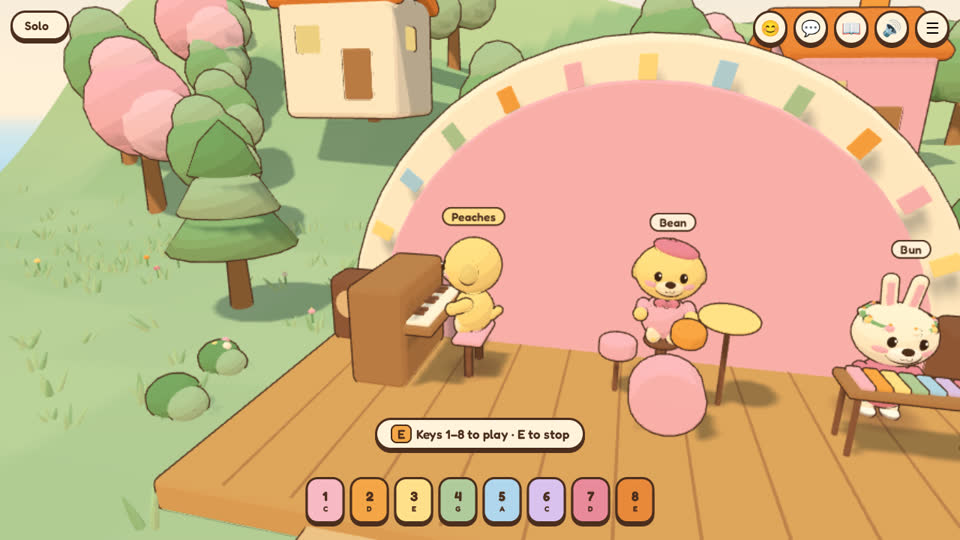
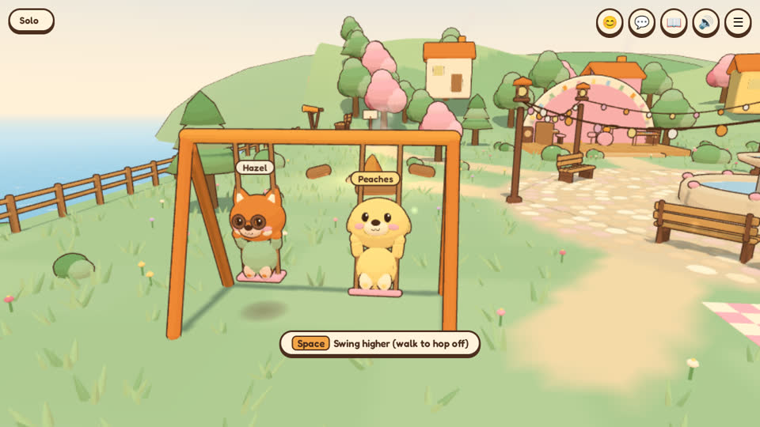

# Hillside Hangout

A cozy little browser game where friends drop into a toon village on a sea cliff as chibi animals. You can walk around, chat, emote, sit on benches, kick a beach ball, fish off the dock, toast marshmallows, swing, jam on the stage, and just hang out. There's no goal and no way to lose.

It's plain static files (Three.js 0.160 from a CDN, no bundler). One **Cloudflare Worker** serves the game, and a **Durable Object** per room keeps everyone in sync. The free Workers plan is enough.


| | |
|---|---|
|  |  |
|  |  |
|  |  |

## What's in the village

- **Plaza:** a fountain, string lights and benches.
- **Café:** grab a mug of cocoa or a milkshake at the counter, or sit on a stool.
- **Pond:** a dock to fish from, lily pads, and ducks paddling in loops.
- **Park:** a swing set, a seesaw, a picnic blanket and a basket of snacks.
- **Stage:** a piano, drums and a xylophone.
- **Campfire:** log seats around it.
- **Lookout:** a hilltop telescope looking out over the sea, where boats sail by.
- **Around the edge:** painted hills, trees and little houses, with a soft invisible wall.
- **Ambient life:** butterflies, ducks, a sleeping cat on a barrel, chimney smoke and swaying grass.
- **Day and night:** a full day takes 20 minutes, and everyone in a room shares the same clock. New rooms start at golden hour. Lamps glow, fireflies come out and stars appear at night.

## How to play

| | Keyboard / mouse | Phone |
|---|---|---|
| Walk / run | WASD or arrows, hold Shift to run | left-hand joystick (push far to run) |
| Look / zoom | drag, mouse wheel | drag with one finger, pinch |
| Hop | Space | ⤒ button |
| Use / sit / stand | E | orange **E** button |
| Emotes | Q (then 1–8) | 😊 |
| Chat | Enter to type, Enter to send, Esc to close | 💬 |
| Ping a spot | G | – |
| Fish book | B | 📖 |
| Sound on/off | M | 🔊 |
| Put down what you're holding | R | – |
| Menu | Esc | ☰ |

**Activities**

- **Ball:** walk into it, or press E next to it for a big kick.
- **Fishing:** go to the end of the dock and press E. Press E again to cast, then E as soon as the bobber dips. Catches are saved in your fish book on this device. Some only bite at night or at golden hour.
- **Campfire:** anyone can light it, and it burns for 10 minutes. Press E to toast a marshmallow, then E again to pull it out when it's golden. Your marshmallow stays in your paws so everyone can see it.
- **Swings:** press Space or E to pump higher.
- **Seesaw:** two friends on it bob each other up and down.
- **Instruments:** press keys 1–8 or tap the pads. Notes play on a pentatonic scale and snap lightly to a shared beat, so jamming together sounds nice.
- **Telescope:** look through it to see the boats out at sea.

## Run it locally

You need Node 18 or newer.

```sh
npm install
npx wrangler dev --persist-to /tmp/hangout-rooms
```

Open http://localhost:8787. To try multiplayer, open a second browser window (or a private window), then either join with the room code or paste the invite link.

Keep the `--persist-to` folder outside the project. Wrangler watches the project folder, and saving room state inside it makes the dev server reload itself in a loop. For the same reason, the test screenshots go to `/tmp/hangout-shots`.

## Deploy it from scratch (macOS)

1. **Install Node.** Download the LTS installer from https://nodejs.org and run it. Then open **Terminal** and check that it worked:
   ```sh
   node -v
   ```
2. **Get the code.**
   ```sh
   git clone https://github.com/adjames1021-dotcom/Cliff-Side-Hang.git
   cd Cliff-Side-Hang
   npm install
   ```
   If macOS offers to install the "command line developer tools" when you run `git`, say yes and run the command again. You can also download the ZIP from GitHub and `cd` into the unzipped folder.
3. **Log in to Cloudflare.** A free account is fine.
   ```sh
   npx wrangler login
   ```
   A browser window opens. Click **Allow**, then come back to Terminal.
4. **Deploy.**
   ```sh
   npx wrangler deploy
   ```
5. **Pick a workers.dev subdomain if it asks.** The first time, Wrangler may ask you to register one (for example `yourname`). You can also do this in the Cloudflare dashboard under **Workers & Pages**. When the deploy finishes, it prints your address, something like `https://hillside-hangout.yourname.workers.dev`.
6. **Check it's alive.** Open `https://hillside-hangout.yourname.workers.dev/health`. You should see `{"ok":true}`.
7. **Share it.** Open the site, press **Play**, make your critter and press **Create a room**. Then use **Copy invite link** (in the ☰ menu, or by tapping the room code in the top-left corner) and send it to your friends. Opening the link drops them straight into your room.

### Updating later

```sh
cd Cliff-Side-Hang
git pull
npx wrangler deploy
```

Rooms keep their state (the clock, the ball and the campfire) across deploys.

### Will the free plan be enough?

Yes, for friends hanging out. At the time of writing, the [Workers Free plan](https://developers.cloudflare.com/durable-objects/platform/pricing/) includes SQLite-backed Durable Objects with:
- 100,000 requests a day
- 13,000 GB-s of duration a day
- 5 GB of storage

How this game uses that:
- **Static files** (the game itself) are free.
- **Movement:** each player sends about 10 small messages a second, and only while moving. Cloudflare counts incoming WebSocket messages at 20:1, so eight people walking around nonstop use roughly 4 requests a second. That works out to several hours of busy play a day.
- **Idle players** only send a keepalive ping every 20 s. The room answers it automatically without waking up.
- **Quiet rooms** hibernate, and hibernating rooms aren't billed for duration.

If you ever go over a daily limit, new requests fail until the next day. Nothing is charged on the free plan.

## Hosting the page somewhere else

The Worker can serve everything. If you'd rather host the page elsewhere (GitHub Pages, Netlify and so on), keep the Worker for the rooms and either:

- set `DEFAULT_SERVER` at the top of [`src/net.js`](src/net.js) to your Worker's address, or
- on the character screen, click **Server → change** and paste the Worker's address. It's remembered on that device.

Invite links made this way carry the server address along, so friends connect to the right place. With no server at all, **Wander solo** still lets you explore everything on your own.

## How it fits together

```
index.html            page, HUD, lobby, creator, chat and all the styles
src/main.js           game loop, camera, input, players, seats, chat, emotes, pings
src/world.js          the hand-made map, colliders, seats, ducks/boats/butterflies
src/characters.js     chibi animals, accessories, props, waddle + emote animations
src/toon.js           toon materials, ink outlines, rounded shapes, mesh merging
src/daynight.js       sky, sun/moon, fog, lamp glow, fireflies over the shared day
src/effects.js        particles: hearts, sparkles, notes, puffs, z's, confetti, glows
src/ui.js             character creator, toasts, action prompt, emote wheel
src/net.js            connection, reconnects, lobby panel, chat box, invite links
src/sync.js           interpolation of other players, shared clock, seats, campfire
src/audio.js          WebAudio piano/xylophone/drums and little sound effects
src/activities/*.js   ball, fishing, campfire, playground, music, café, lookout
server/worker.js      the Worker (assets, /health, /room/CODE) and the Room Durable Object
wrangler.toml         Worker + Durable Object config (SQLite-backed, free plan friendly)
tests/*.mjs           Playwright checks (multiplayer, activities, custom server, screenshots)
```

**The room server** (`server/worker.js`) uses the WebSocket Hibernation API and SQLite storage. It:
- holds up to 8 players
- sends each newcomer the roster, the room clock and the shared state
- relays movement
- referees seats ("someone's already there")
- validates and rate-limits every message: names are capped at 16 characters, chat at 140, and positions are clamped
- sweeps sockets that silently vanish

The beach ball is simulated by whoever touched it last, and the server keeps it in bounds. A second connection with the same client id replaces the first, so a reload or a network blip never leaves a ghost behind. Someone turned away from a full room never triggers a "left" message.

## Tests

The checks drive real headless browsers against `wrangler dev`:

```sh
npx wrangler dev --persist-to /tmp/hangout-rooms     # in one terminal
npx playwright install chromium                      # once
node tests/multiplayer.mjs     # joining by code/link, movement, chat, emotes, seats, props, ball, campfire, full room, reloads
node tests/activities.mjs      # fishing, toasting, swings, seesaw, music, café, telescope, ball, pings
python3 -m http.server 8790 &  # then: page hosted elsewhere + pasted server address
node tests/server-address.mjs
node tests/screens.mjs         # screenshots into /tmp/hangout-shots
```

You need Playwright installed (`npm i -D playwright`, or set `PLAYWRIGHT_MODULE` to an existing install). Pages opened with `?norender` skip drawing, so several software-rendered browsers can share one machine.

## Credits

Made with [Three.js](https://threejs.org), the [Fredoka](https://fonts.google.com/specimen/Fredoka) font, and Cloudflare Workers + Durable Objects. Every sound is synthesized in the browser.
